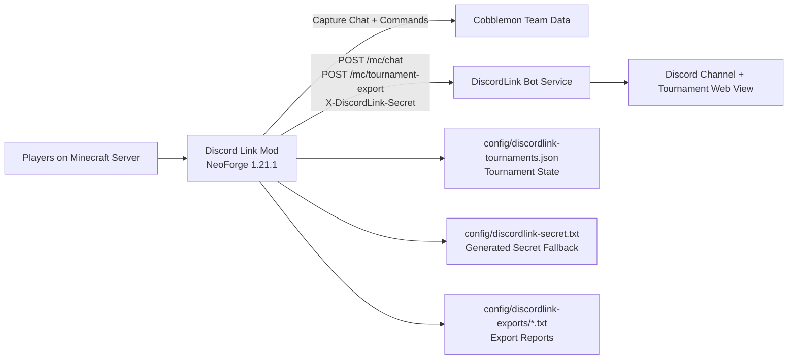

# Discord Link Mod

NeoForge mod for Minecraft 1.21.1 that bridges Minecraft server activity and Cobblemon tournament workflows to a companion Discord bot.

## Version Matrix

- Mod version: `1.1.0`
- Minecraft: `1.21.1`
- NeoForge: `21.1.219`
- Java: `21`

## Core Capabilities

- Relays Minecraft chat and startup status to Discord.
- Provides Cobblemon team registration and verification commands.
- Persists tournament registrations with lockable state.
- Exports tournament snapshots to the companion bot for web viewing.
- Uses shared-secret authentication for all mod-to-bot HTTP requests.

## Integration Contract

The mod sends authenticated HTTP requests to the bot.

### Chat Relay Endpoint

- `POST <BOT_BASE_URL>/mc/chat`

Example payload:

```json
{
  "player": "SERVER",
  "message": "@minecraft Server has started."
}
```

Auth header:

- `X-DiscordLink-Secret: <secret>`

### Tournament Export Endpoint

- `POST <BOT_BASE_URL>/mc/tournament-export`
- Sends tournament snapshot data for storage and web rendering.

## Runtime Configuration

### Bot Base URL Resolution Order

1. Environment variable: `DISCORDLINK_BOT_BASE_URL`
2. JVM property: `-Ddiscordlink.bot.base.url=...`
3. Fallback: `https://dripmon-discord-production.up.railway.app`

### Shared Secret Resolution Order

1. Environment variable: `DISCORDLINK_SHARED_SECRET`
2. JVM property: `-Ddiscordlink.shared.secret=...`
3. Auto-generated file: `config/discordlink-secret.txt`

Admin utility command:

- `/discordsecret`
  - Prints the active secret to server console.
  - Useful when the secret was generated at runtime.

## Commands

### Player Commands

- `/registerteam`
  - Sends current Cobblemon team details to Discord as a report preview.
- `/registerteam <tournament name>`
  - Saves or replaces your current team snapshot for the target tournament (unless locked).
- `/check <tournament name> <player name>`
  - Compares the target player's current team against their registered team snapshot.
  - Broadcasts a pass message to server chat on successful match.
- `/unregisterteam <tournament name>`
  - Removes your registration from an unlocked tournament.

### Admin Commands

- `/registertournament <tournament name>`
  - Creates a new tournament record.
- `/locktournament <tournament name>`
  - Permanently locks tournament registrations.
- `/listtournaments`
  - Lists tournaments, status, and registration counts.
- `/tournamentinfo <tournament name>`
  - Shows tournament metadata and registered players.
- `/exporttournament <tournament name>`
  - Exports tournament report to `config/discordlink-exports/`.

## Team Verification Rules

Verification for `/check` is order-insensitive:

- Pokemon order does not matter.
- Move order does not matter.

Fields used for identity matching:

- Species
- Ability
- Held item
- Nature
- Gender
- Form
- IV spread
- EV spread
- Moveset

Ignored fields:

- Nickname
- Shiny flag

## Persistence and Output Files

- `config/discordlink-secret.txt`
  - Bridge secret (only when auto-generated).
- `config/discordlink-tournaments.json`
  - Tournament definitions, lock state, and registrations.
- `config/discordlink-exports/*.txt`
  - Tournament export reports.

## Requirements

- Java 21 runtime
- Minecraft 1.21.1 server with NeoForge 21.1.219
- Cobblemon installed on the same server
- Companion service: DiscordLink bot project

## Build and Run (Windows)

```powershell
.\gradlew.bat runServer
.\gradlew.bat build
```

Dependency refresh:

```powershell
.\gradlew.bat --refresh-dependencies
.\gradlew.bat clean
```

## Resume-Ready Impact Bullets

- Built a NeoForge integration mod for Minecraft 1.21.1 that forwards live server activity to Discord through a secure HTTP bridge.
- Engineered Cobblemon tournament workflows, including team registration snapshots, lock controls, and integrity verification commands.
- Implemented deterministic team matching logic with order-insensitive validation for Pokemon and move sets.
- Designed resilient runtime configuration with layered environment/JVM/file-based secret and endpoint resolution.
- Delivered operational export tooling that produces shareable tournament reports for external web visualization.

## Architecture Diagram



## Project Structure

- `src/main/java/com/example/discordlink/DiscordLinkMod.java`: command handling, bot bridge integration, Cobblemon reflection logic
- `src/main/templates/META-INF/neoforge.mods.toml`: NeoForge metadata template
- `gradle.properties`: Minecraft, NeoForge, and mod metadata/version values
